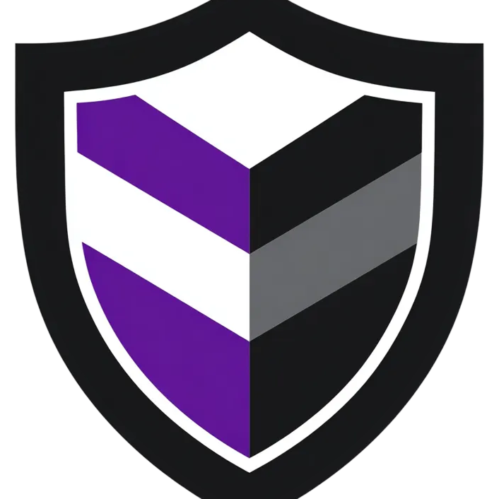

<h1 align="center">
<sub>

</sub>
Zentat
</h1>
<p align="center">
<b>A privacy-focused browser extension that converts fiat prices to ZEC in real-time.</b>
</p>

<p align="center">
<a href="https://chromewebstore.google.com/detail/zentat/"></a>
<a href="LICENSE"></a>
</p>

---

## What is Zentat?

Zentat automatically detects and converts fiat currency prices on any webpage to Zcash. Browse Amazon, eBay, news sites, or any website and see prices in ZEC instead of USD, EUR, GBP, and other currencies.

<p align="center">

</p>

**Features:**

- Real-time price conversion on any website
- Supports 12 fiat currencies (USD, EUR, GBP, JPY, CAD, AUD, CHF, CNY, KRW, INR, BRL, MXN)
- Optional privacy-preserving exchange rate fetching via [Nym](https://nymtech.net)
- Replace prices outright, or append the ZEC value next to the original — your choice
- Configurable precision (auto significant figures, or 2/4/6/8 decimals) with automatic zats display for small amounts
- Hover over converted prices (dotted underline) to see the original amount
- Works with complex price formats (thousand separators, European notation, Indian lakh grouping, Swiss apostrophes, etc.)

## Usage

- **Toggle conversion** anywhere with <kbd>Alt+Z</kbd>, from the toolbar popup, or per-site with the popup's "Disable here" button.
- **Hover** any converted price (marked with a dotted underline) to see the original fiat amount.
- **Site filtering**: run Zentat everywhere except a blocklist, or only on an allowlist — configured in the popup or the options page.
- **Options** (right-click the toolbar icon → Options, or the popup's Options button): currencies, display mode, precision, rate source, and Nym.
- The toolbar badge shows `OFF` when conversion is paused and `!` when the cached exchange rate is stale.

## Installation

**Chrome**: Install from the [Chrome Web Store](https://chromewebstore.google.com/detail/zentat/).

**Firefox**: Firefox Add-ons doesn't accept the Nym library due to file size limits, so install the signed `.xpi` from [GitHub Releases](https://github.com/maxdesalle/zentat/releases): download it, then open `about:addons` → gear menu → **Install Add-on From File…** and select the file. (An unsigned `.zip` only works as a temporary add-on via `about:debugging` and is removed on restart.)

## Privacy

Zentat is designed with privacy as a core principle:

- **No accounts**: Zentat requires no sign-up or authentication
- **No tracking**: No analytics, telemetry, or user tracking of any kind
- **No external requests** (except rate fetching): All price detection and conversion happens locally in your browser
- **Settings stored locally**: Your preferences are kept in the browser's local (non-synced) storage and never leave your device
- **Rate fetching**: Exchange rates come from CoinGecko, with Kraken as an automatic fallback — always the same fixed request, never anything derived from your browsing or settings
- **Minimal permissions**: No blanket host permissions; extension-context network access is limited to the rate APIs and Nym gateways
- **Optional Nym integration**: Exchange rate requests can be routed through the Nym mixnet, hiding your IP address from the exchange rate API (never falls back to a direct request while enabled)

See [PRIVACY.md](PRIVACY.md) for the full policy.

## Development

```sh
just install    # install dependencies (bun or npm)
just dev        # run in Chrome with hot reload
just test-unit  # unit tests
bun run typecheck  # or: npm run typecheck
```

## Support

Found a bug? [Open an issue](https://github.com/maxdesalle/zentat/issues) or [reach out on Signal](https://signal.me/#eu/TST_2FkJznjly3Xkn2NnsNRDw32eoOTHwO0L9REt2N1A2fOQ_vdKEYb-C-KsvEW6).

## License

Zentat is open source software licensed under the [MIT License](LICENSE).
